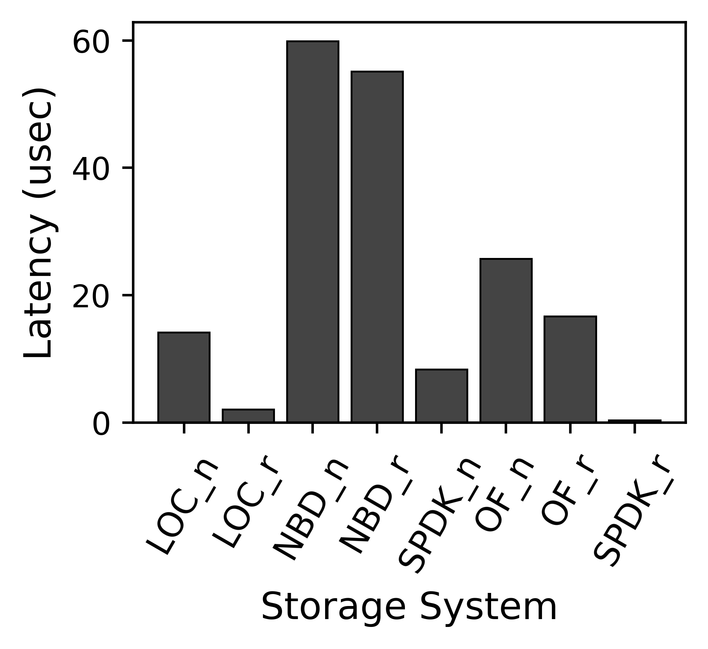

# pyPlot1bar
Python scrypt to generate bar plot with one bar from each x index.

## Example Plot



## Overview

This script reads data from a file, parses it, and generates a bar plot. Each bar represents a specific measurement related to storage system latency. The script also saves the plot in pdf format ready for LaTex. 

## Script Configuration

The script uses a configuration file (`config.py`) to adjust the appearance of the plot.

- `fullfigsize = (13, 2)`: Full figure size.
- `halffigsize = (7, 3)`: Half figure size.
- `thirdfigsize = (5, 3)`: One third figure size.
- `quartfigsize = (3.25, 3)`: One fourth figure size.
- `eightfigsize = (1.625, 1.6)`: One eighth figure size.
- `fontsize = 12`: Font size.
- `linewidth = 3`: Main line width.
- `linewidth_2 = 0.6`: Secondary line width.
- `edgewidth = 1.2`: Edge width of bars.
- `edgecolor = 'k'`: Edge color (black).
- `markersize = 12`: Marker size.
- `bar_width = 0.8`: Bar width.
- `colors = ['#444444', '#888888', '#cccccc']`: Color palette.
- `dpi = 600`: Plot quality (dots per inch).
- `workload_name_pos = -0.01`: Position adjustment for workload names.
- `bbox_to_anchor = (0.5, -0.27)`: Legend position.
- `bar_names_loc = -160`: Position adjustment for bar names.
- `group_spacing_factor = 3.2`: Spacing between groups in the plot.

## Data File (`data.txt`)

The data file should be in the following format:

bar=LOC_n
13
bar=LOC_r
21
bar=NBD_n
20.2
bar=NBD_r
30.8
bar=SPDK_n
15
bar=SPDK_b
12
bar=OF_n
25
bar=OF_r
22.39
bar=SPDK_r
4
## Usage

1. **Prepare your `data.txt` file** following the format described above. (you can optionaly chose diferent configuration from the `config.py`).

2. **Run the script**: ```./run.sh ```

3. The plot will be saved as `plot-crop.pdf` in the same directory.

